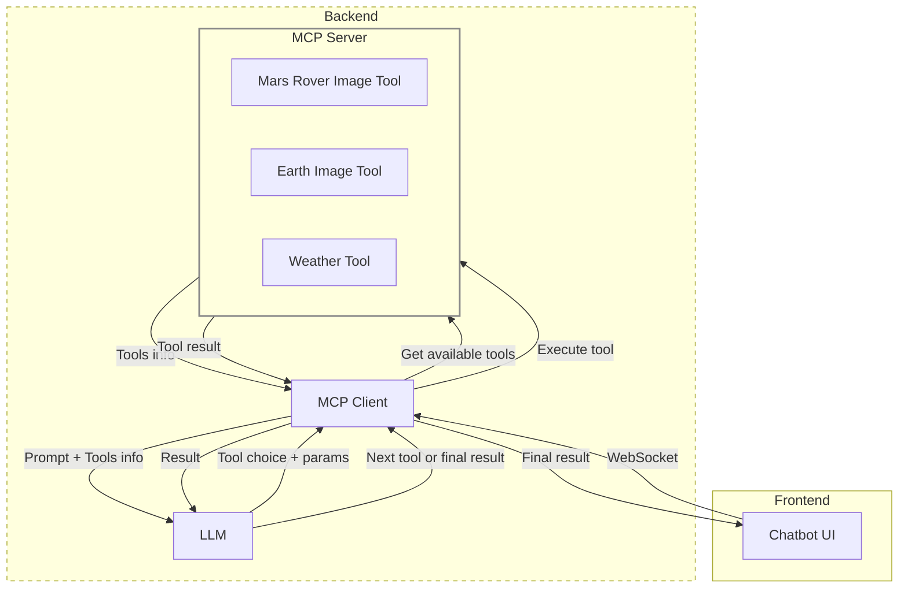

# MCP WebSocket Server

A WebSocket server that integrates with Model Context Protocol (MCP) clients to provide tool-enabled AI conversations.

The Frontend code for this repo is present in the [MIE Chatbot](https://github.com/adithya1012/MIE_ChatBot).

## Project Structure

```
├── README.md
├── client
│   ├── build
│   │   ├── index.js                     # MCP Client
│   │   ├── mcpClientManager.js
│   │   └── server.js                    # Websocket connection
│   ├── package-lock.json
│   ├── package.json
│   ├── src
│   │   ├── index.ts
│   │   ├── mcpClientManager.ts
│   │   └── server.ts
│   └── tsconfig.json
└── server
    ├── README.md
    ├── main.py
    ├── pyproject.toml
    ├── tools
    │   ├── index.py                    # MCP Server
    │   └── mars_img.py
    └── uv.lock
```

## Architecture



## YouTube UpdatesAdd commentMore actions

| Description                                                       | YouTube Short                                                                  | Commit/PR                                                                                                   | Date                                                                                                                                                                                                                                                                       |
| ----------------------------------------------------------------- | ------------------------------------------------------------------------------ | ----------------------------------------------------------------------------------------------------------- | -------------------------------------------------------------------------------------------------------------------------------------------------------------------------------------------------------------------------------------------------------------------------- |
| Commit Mermaid diagram on the MCP Chatbot                         | [Watch](https://youtube.com/shorts/YSOqYVHAsjg)                                | [Commit](https://github.com/adithya1012/MIE_ChatBot/commit/b00f89d741af162aeba4b8f16b3669898979d265)        | [June 18](https://docs.google.com/document/d/1RGVLmfMQ1EpN2uXK2a6YLVcGXwu7ZrbIWCEe7AmRHBc/edit?pli=1&tab=t.0#heading=h.mrf11jp1gp4)                                                                                                                                        |
| Vite Learning                                                     | [Watch](https://youtube.com/shorts/EZeK7EcgFY4)                                | [PR](https://github.com/adithya1012/Learning/pull/1)                                                        | [June 17](https://docs.google.com/document/d/1RGVLmfMQ1EpN2uXK2a6YLVcGXwu7ZrbIWCEe7AmRHBc/edit?pli=1&tab=t.0#heading=h.f3pej13xvumg)                                                                                                                                       |
| MCP chatbot architecture and Clean up folder structure.           | [Watch](https://youtube.com/shorts/Ib9I8vepgPY)                                | [PR1](https://github.com/adithya1012/MIE_ChatBot/pull/18), [PR2](https://github.com/adithya1012/MCP/pull/1) | [June 14](https://docs.google.com/document/d/1RGVLmfMQ1EpN2uXK2a6YLVcGXwu7ZrbIWCEe7AmRHBc/edit?pli=1&tab=t.0#heading=h.8pcaemy93me2), [June 16](https://docs.google.com/document/d/1RGVLmfMQ1EpN2uXK2a6YLVcGXwu7ZrbIWCEe7AmRHBc/edit?pli=1&tab=t.0#heading=h.4kqr6yuqq850) |
| UI for MCP architecture demo                                      | [Watch](https://youtube.com/shorts/l_go1mo4wHY)                                |                                                                                                             |                                                                                                                                                                                                                                                                            |
| MCP backend API testing Postman                                   | [Watch](https://youtube.com/shorts/qY5o8yI-bZQ)                                |                                                                                                             |                                                                                                                                                                                                                                                                            |
| Simple CMD line interaction with MCP architecture.                | [Watch](https://youtube.com/shorts/3tGSEd2r8D0)                                |                                                                                                             |                                                                                                                                                                                                                                                                            |
| MCP - Inspector 🚓🚨                                              | [Watch](https://youtube.com/shorts/URPhnDYoKq4)                                |                                                                                                             |                                                                                                                                                                                                                                                                            |
| MCP client (TypeScript/Node) server (python) with🌡️ Weather tool. | [Watch](https://youtube.com/shorts/TJvB7dl9_8Y)                                |                                                                                                             |                                                                                                                                                                                                                                                                            |
| MCP architecture diagram                                          | [Watch](https://youtube.com/shorts/NlC0rGRSANQ)                                |                                                                                                             |                                                                                                                                                                                                                                                                            |
| VS code copilot MCP tool attachment in agent mode                 | [Watch](https://youtube.com/shorts/5t2vZ07zfus)                                |                                                                                                             |                                                                                                                                                                                                                                                                            |
| Simple MCP                                                        | [Watch](https://youtube.com/shorts/JYjJavez4Xo)                                |                                                                                                             |                                                                                                                                                                                                                                                                            |
| Mars Image API integration:                                       | [Watch](https://youtube.com/shorts/LMLNdOsZnFk)                                |                                                                                                             |                                                                                                                                                                                                                                                                            |
| Earth Image API integration:                                      | [Watch](https://youtube.com/shorts/WJMUf-ZXRyQ)                                |                                                                                                             |                                                                                                                                                                                                                                                                            |
| YAML File Integration                                             | [Watch](https://youtube.com/shorts/CovI4RM3zrg)                                |                                                                                                             |                                                                                                                                                                                                                                                                            |
| MultiTool Integration + Chat history                              | [Watch](https://youtube.com/shorts/J4uz3EOss80)                                |                                                                                                             |                                                                                                                                                                                                                                                                            |
| LLM Response Parsing (XML)                                        | [Watch](https://youtube.com/shorts/CCQt4RiIYJE)                                |                                                                                                             |                                                                                                                                                                                                                                                                            |
| Exploring NASA APIs                                               | [Watch](https://youtube.com/shorts/cBbhRo6dW5E)                                |                                                                                                             |                                                                                                                                                                                                                                                                            |
| Other                                                             | [Watch1](https://youtu.be/GklINnKCvQs), [Watch2](https://youtu.be/90mmfmDyxn8) |                                                                                                             |                                                                                                                                                                                                                                                                            |

## Setup Instructions

### 1. Install Dependencies

```bash
npm install
```

### 2. Environment Configuration

Copy the example environment file and add your API keys:

```bash
cp .env.example .env
```

Edit `.env` and add your API keys:

```bash
OPENAI_API_KEY=your_openai_api_key_here
ANTHROPIC_API_KEY=your_anthropic_api_key_here
```

### 3. Update MCP Configuration

In `src/server.ts`, update the `mcpConfig` object to point to your actual MCP server:

```typescript
const mcpConfig: MCPClientConfig = {
  scriptPath: "../path/to/your/mcp-server.py", // Update this path
  pythonPath: "../path/to/your/venv", // Update this path
  venvPath: "../path/to/your/venv", // Update this path
  provider: "openai", // or "claude"
};
```

## Running the Server

### Development Mode

```bash
npm run dev
```

### Production Mode

```bash
npm run build
npm start
```

## Usage

### WebSocket Connection

Connect to the WebSocket server at:

```
ws://localhost:8090
```

Send messages as JSON:

```json
{
  "query": "What is the weather like today?"
}
```

Or send plain text messages directly.

### HTTP API

#### Health Check

```bash
GET http://localhost:3000/health
```

#### Execute Query

```bash
POST http://localhost:3000/mcp/execute
Content-Type: application/json

{
  "message": "Your question here"
}
```

#### Check MCP Status

```bash
GET http://localhost:3000/mcp/status
```

## Features

- **WebSocket Server**: Real-time communication on port 8090
- **HTTP REST API**: HTTP endpoints on port 3000
- **MCP Integration**: Seamless tool calling through MCP protocol
- **Multi-Provider Support**: Both OpenAI and Claude support
- **Error Handling**: Comprehensive error handling and logging
- **Message Queuing**: Queues messages when MCP client is initializing

## Architecture

1. **Client** connects via WebSocket or HTTP
2. **Server** receives messages and forwards to **MCP Client Manager**
3. **MCP Client Manager** processes queries through **MCP Client**
4. **MCP Client** communicates with **MCP Server** and **LLM Provider**
5. **Tools** are executed as needed
6. **Response** flows back through the chain to the client

## Troubleshooting

### Common Issues

1. **MCP Client not ready**: Ensure your MCP server path is correct and the Python environment is set up properly.

2. **API Key errors**: Make sure your `.env` file contains valid API keys for your chosen provider.

3. **Connection errors**: Check that your MCP server script exists and is executable.

4. **Port conflicts**: Ensure ports 8090 and 3000 are available.

### Debug Logs

The server provides comprehensive logging. Check the console output for detailed error messages and connection status.
